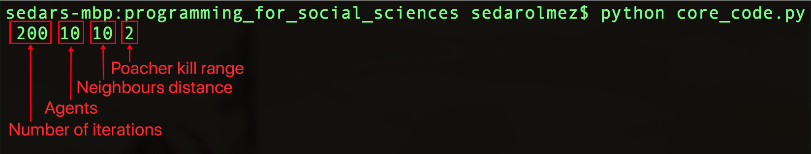

# programming_for_social_sciences
Centre for Data Analytics and Society

# Step 1)
Launch terminal and pass the arguments tailored to your needs:

1) Number of iterations: how many iterations would you like the simulation to play i.e. 100 is 100 frames.
2) Number of agents: how many sheep agents would you like to spawn, 10 would produce 10 sheep agents. 
3) Neighbours distance: how close would two sheeps have to be to identify that they are neighbours.
4) Poacher kill range: how close would the sheep have to be to the poacher for it to shoot.

# Step 2)
Watch how the poacher agent finds the sheep: 

# Few notes:
- The Main_model.py was my training script to test out a few techniques, the actual code is located in the core_code.py script and agentframework.py script.
